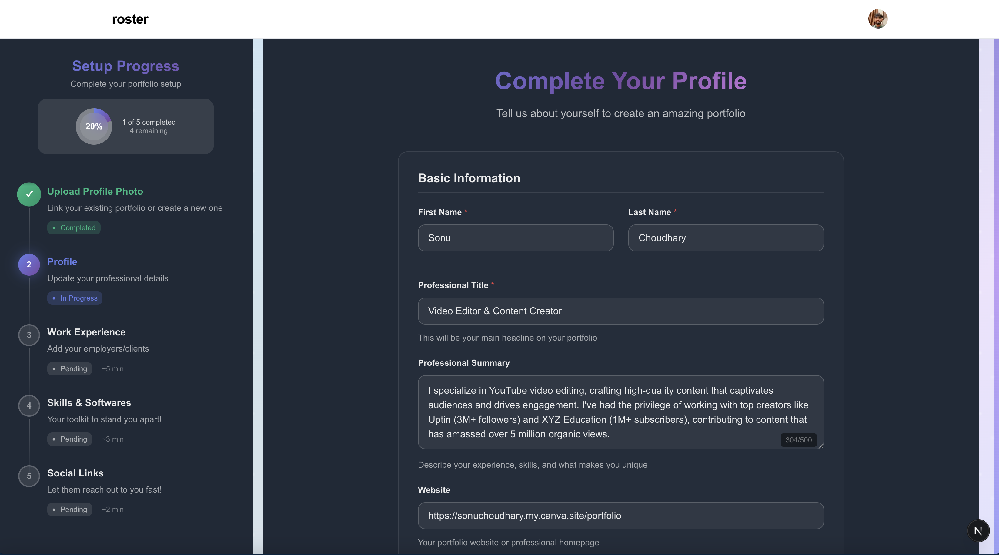
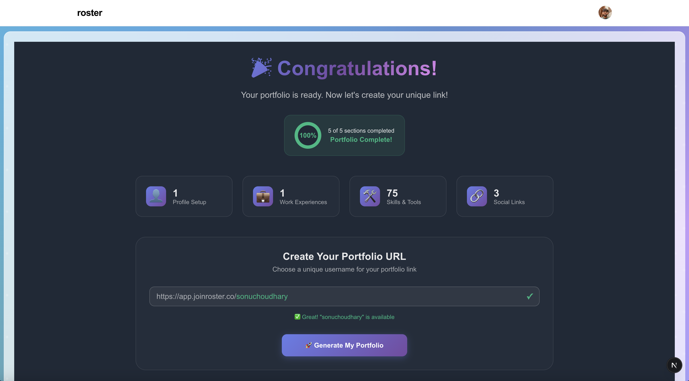

# Portfolio Onboarding Roster

A Next.js application for creating and managing professional portfolios with a streamlined onboarding process.

## Project Overview

Portfolio Onboarding Roster is a web application that allows users to create personalized professional portfolios. The application guides users through a step-by-step onboarding process to collect their professional information, work experience, skills, and social links, ultimately generating a unique portfolio website.

## Tech Stack

- **Frontend**: Next.js, TypeScript, React
- **State Management**: Redux Toolkit
- **Styling**: CSS Modules
- **Animations**: Framer Motion
- **Form Handling**: Custom form components

## Design of System

|                   Design Structure                    |
| :---------------------------------------------------: |
|  |

## Product Overview

|                     Landing Screen                     |
| :----------------------------------------------------: |
|  |

|                   Upload your Profile Photo                   |
| :-----------------------------------------------------------: |
|  |

|                        Complete Your Profile                         |
| :------------------------------------------------------------------: |
|  |

|                         Work Experience                         |
| :-------------------------------------------------------------: |
|  |

|                     Skills & Software                     |
| :-------------------------------------------------------: |
|  |

|                 Social Media Handles                 |
| :--------------------------------------------------: |
|  |

|                     Dashboard                      |
| :------------------------------------------------: |
|  |

|                     Portfolio Preview                     |
| :-------------------------------------------------------: |
|  |

## Features

- Multi-step onboarding process
- Portfolio URL generation with username validation
- Form validation and error handling
- Animated transitions and UI elements
- Portfolio preview and completion tracking
- Responsive design

## User Flow

1. **Homepage**

- User lands on the homepage with an animated welcome message
- User enters their existing portfolio URL or starts from scratch
- System validates the URL format

2. **Onboarding Process**

- **Step 1: Profile Photo**
- User uploads a professional profile photo
- Photo is stored and displayed in the portfolio

- **Step 2: Personal Information**
- User enters basic information (name, title, summary)
- Contact details (email, phone)
- Location information (city, country, timezone)
- Languages spoken with proficiency levels

- **Step 3: Work Experience**
- User adds professional experience entries
- Each entry includes company, role, duration, and description
- Option to add portfolio items for each experience

- **Step 4: Skills & Tools**
- User adds professional skills as tags
- User adds software and tools they're proficient with
- Skills are categorized and displayed in the portfolio

- **Step 5: Social Links**
- User adds links to social media profiles
- Platforms include LinkedIn, YouTube, Instagram, Twitter, etc.

3. **Dashboard**

- User sees a summary of their portfolio completion
- Stats about work experiences, skills, and social links
- Option to create a unique username for their portfolio URL
- System checks username availability and offers suggestions
- User generates their portfolio with a unique URL
- Options to view, share, or edit the portfolio

4. **Portfolio View**

- The generated portfolio is accessible at `https://app.joinroster.co/{username}`
- Displays all the information collected during onboarding
- Professional layout optimized for showcasing the user's work

## Project Structure

```
portfolio-onboarding-roster/
├── public/ # Static assets
├── src/
│ ├── app/
│ │ ├── api/
│ │ ├── dashboard/
│ │ ├── onboarding/
│ │ └── page.tsx
│ ├── components/
│ │ ├── AnimatedContent/
│ │ ├── AnimatedText/
│ │ ├── FormFields/
│ │ ├── OnboardingStepper/
│ │ ├── PortfolioInput/
│ │ └── Sections/
│ ├── lib/
│ │ ├── slices/
│ │ ├── hooks.ts
│ │ └── store.ts
│ ├── mockData/
│ └── types/
└── ... # Config files
```

## Data Flow

1. User inputs are collected through form components
2. Form data is validated and stored in Redux
3. Each onboarding section updates the portfolio data in the Redux store
4. On completion, the data is sent to the backend to generate a portfolio
5. The generated portfolio URL is displayed to the user

## Form Components

The application uses custom form components for consistent UI and validation:

- `TextField`: Single-line text input
- `TextAreaField`: Multi-line text input
- `SelectField`: Dropdown selection with search capability
- `TagField`: Input for multiple tags with suggestions

## State Management

Redux is used to manage the application state:

- `portfolioSlice`: Manages portfolio data and onboarding progress
- Actions include updating portfolio data and navigating between steps

## API Endpoints

- `/api/check-username`: Validates username availability
- `/api/generate-portfolio`: Creates a portfolio with the provided data
- `/api/portfolio`: Fetches portfolio data from an existing URL

## Getting Started

First, run the development server:

```bash
npm run dev
# or
yarn dev
```

Open [http://localhost:3000](http://localhost:3000) with your browser to see the result.

## Learn More

To learn more about the technologies used:

- [Next.js Documentation](https://nextjs.org/docs)
- [Redux Toolkit](https://redux-toolkit.js.org/)
- [Framer Motion](https://www.framer.com/motion/)
